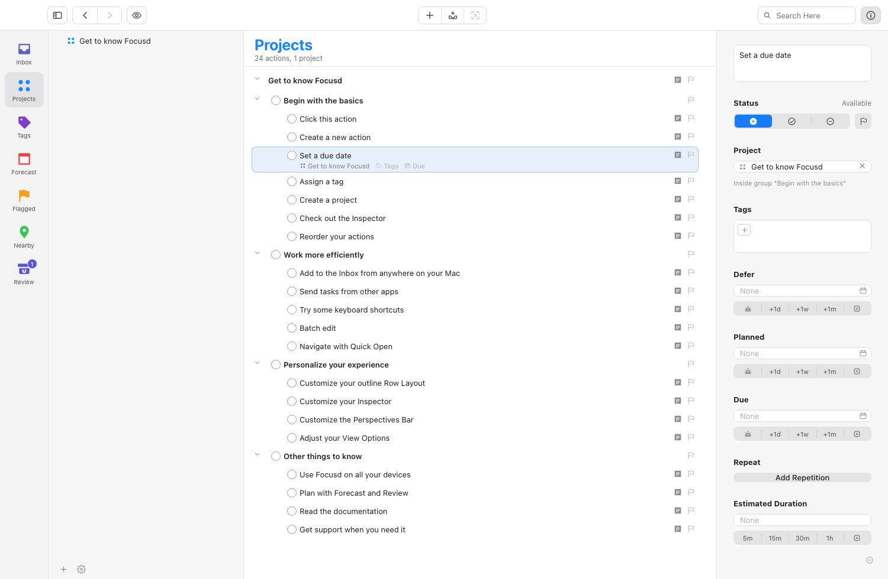
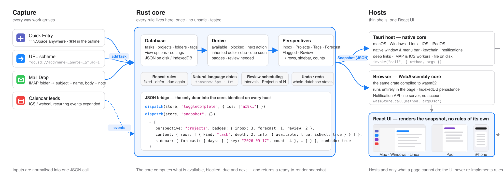
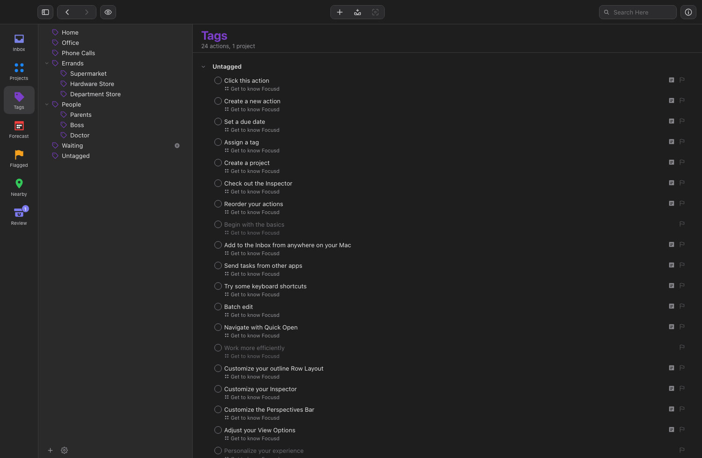
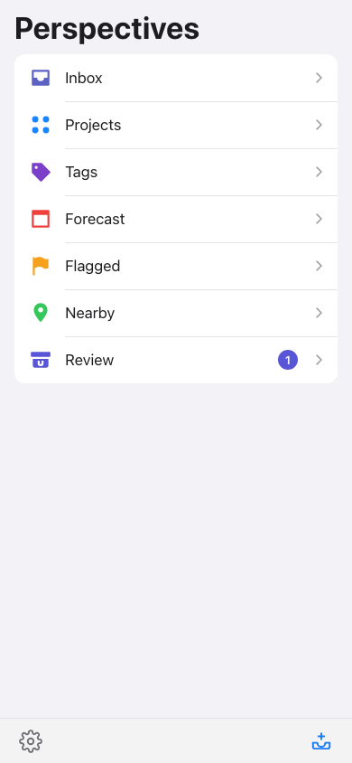

<h1 align="center">Focusd</h1>

<p align="center">
  <b>Task management and planning that behaves the same on every device.</b><br/>
  A local-first, open-source to-do app for macOS, Windows, Linux, iPhone, iPad and the browser — one Rust core, one interface.
</p>

<p align="center">
  <a href="https://github.com/sunyxedu/focusd/actions/workflows/ci.yml"></a>
  <a href="LICENSE"></a>
  <a href="https://hemlix.me/focusd/"></a>
  
  
</p>

<p align="center">
  <a href="#installation">Installation</a> ·
  <a href="#quickstart">Quickstart</a> ·
  <a href="#how-it-works">How it works</a> ·
  <a href="#building-from-source">Building</a> ·
  <a href="AGENTS.md">Contributing</a>
</p>

Focusd is a personal task manager built around the capture → organise → plan → review loop that GTD-style planners use: an Inbox for everything that comes in, projects and tags to organise it, a Forecast to plan the days ahead, and a Review cycle so nothing goes stale. What sets it apart is *where the logic lives*. Every rule — which task is available, which one is next, when something counts as due soon, how a repeating task rolls forward — is implemented once, in a Rust core, and shared unchanged by the native desktop apps, the mobile apps and the web build. There is no account, no server and no sync service in the way: your data is a JSON file on your disk (or in your browser), and you can move it between devices with a single export.

<p align="center">
  
</p>

## Why Focusd

Most task managers make you choose. The polished native ones are locked to one platform family; the cross-platform ones ship a web page in a frame and re-implement their scheduling rules in JavaScript, so "available", "blocked" or "due soon" end up meaning slightly different things on the phone and on the laptop. Both kinds increasingly route your tasks through a cloud account you did not ask for.

Focusd starts from the opposite end. The behaviour of a task manager *is* its data model plus a handful of derivation rules, and that part is small enough to write once and test properly. So the core is a plain Rust crate with no UI and no I/O beyond reading and writing JSON. Everything a screen needs — the rows of a perspective, their indentation, the badge counts, whether a checkbox should look blocked — is computed there and handed to the interface as a finished snapshot. The interface only draws.

Because the core is a library, it can be hosted anywhere a library can run. Tauri wraps it into real native applications with a native window, menu bar, keychain and notifications; the same crate compiled to WebAssembly runs it inside the browser tab. The result is one behaviour, one look and one keyboard vocabulary on six platforms, without a backend.

## How it works

The figure follows a task through the system, from the moment it is captured to the moment it is drawn.

<p align="center">
  
</p>

**Capture.** Work enters through whichever door is closest: the outline itself (⌘N), the Quick Entry panel (⌃⌥Space) from any app, the `focusd://add` URL scheme from scripts and mail rules, or Mail Drop, which watches an IMAP folder and turns each unread message into an Inbox item. Calendar subscriptions come in the same way, as read-only events for Forecast. All of these become one JSON call into the core.

**Derive.** Given the database, the core computes what the interface must never guess. A task is *available* only if it is not completed or dropped, not deferred to the future, not inside an on-hold project or tag, not waiting behind an earlier sibling in a sequential project, and not a group with unfinished children. The first available task of each container is the *next action*. Defer and due dates flow down from projects and groups to their children, so a due date on a project makes every child due soon at the right moment. Repeating tasks roll forward with one of three rules (on a fixed schedule, or a fixed distance after completion for defer or due), and projects carry their own review interval.

**Perspectives.** On top of the derived state the core builds the seven views — Inbox, Projects, Tags, Forecast, Flagged, Nearby, Review — already filtered by the View Options you chose (first available / available / remaining / everything), already grouped, already counted. The result is a *snapshot*: rows with depth and status, the sidebar tree, the Forecast calendar and the badges.

**Hosts.** The desktop and mobile apps embed the core natively and talk to it through a single `invoke("call", { method, args })` command; the web build calls the same functions in WebAssembly. Both hand the snapshot to the same React interface, which lays it out for a Mac window, an iPad or a phone, in light or dark. The hosts add only what a page cannot do on its own: the native menu bar, window state, the OS keychain for the Mail Drop password, system notifications, deep links, and the background workers that fetch mail and calendars.

## Installation

Download the build for your platform from the [releases page](https://github.com/sunyxedu/focusd/releases), or open the [web app](https://hemlix.me/focusd/) — it runs entirely in your browser and keeps its data there.

| Platform | Package | Notes |
|---|---|---|
| macOS | `.dmg` | Toolbar in the title bar; native menu bar |
| Windows | `.msi` / `.exe` | |
| Linux | `.AppImage` / `.deb` | Needs WebKitGTK 4.1 |
| iPhone / iPad | Xcode project in `desktop/gen/apple` | Build and install with your own signing team (see [Building](#building-from-source)) |
| Web | [hemlix.me/focusd](https://hemlix.me/focusd/) | Data lives in IndexedDB; export to move it elsewhere |

Every build starts with a small tutorial project that walks through the interface. Delete it, or erase everything, from Settings → Data.

## Quickstart

The first thing to do in Focusd is to stop deciding. Press **⌃⌥Space** from anywhere (or **⌘N** inside the app), type what is on your mind, press Return. It lands in the Inbox; you will sort it later. From a script, a shortcut or a mail rule, do the same through the URL scheme:

```
focusd://add?name=Renew%20passport&note=expires%20in%20March&flag=1
```

When you sit down to organise, drag Inbox items onto projects in the sidebar, or press Tab on a row to jump to its project and tag fields. A project can be **parallel** (any action can be done next), **sequential** (only the first remaining action is available) or a **single-action list**. Tags can be nested, put on hold (everything tagged with them waits) or marked as not allowing a next action. None of this needs a dialog: the outline, the inspector (⌥⌘I) and the context menu edit the same fields.

Dates are typed, not clicked. The Defer, Planned and Due fields understand the language you would use with a colleague:

```
tomorrow 5pm      fri      next week      2w      sep 20      +1m      17:30
```

A *deferred* task hides until its date; a *due* task turns orange 48 hours before and red after (the window is a setting). To make a task recur, add a repetition in the inspector — every week on Mon/Fri, or "two days after I finish it".

Planning happens in **Forecast**: the next fourteen days across the top, each with its count, and your subscribed calendar events listed in time order above the tasks of the day, so you can see what actually fits. Drag a task onto a day to give it that due date. **Review** then walks you through every project on its own schedule — one project at a time, "Project 3 of 12", with a Mark Reviewed button that moves to the next.

Everything is on the keyboard: ⌘1–⌘7 switch perspectives, Space completes, ⇧⌘L flags, ⌘K cleans up completed rows, ⌘O opens Quick Open, and ⌘Z undoes any change, including a whole batch edit. The full list is under Help → Keyboard Shortcuts.

### Bringing your mail and calendars in

Open Settings (⌘,). Under **Mail Drop**, enter an IMAP server and a folder to watch — a dedicated Gmail label or a `you+focusd@` sub-address works well — and save the password; it is stored in the OS keychain, never in the database. From then on every unread message in that folder becomes an Inbox item: subject → name, body → note, a `!` prefix → flagged. Under **Calendar**, paste any ICS or webcal URL; recurring events are expanded and shown in Forecast, and can be hidden per perspective from View Options. Under **Notifications**, choose whether to be told when something comes due and how many minutes ahead.

<p align="center">
  
  
</p>

## Building from source

```bash
# Rust core: behaviour tests and lints
cargo test -p focusd_core
cargo clippy -p focusd_core -- -D warnings

# Web build (core compiled to WebAssembly)
rustup target add wasm32-unknown-unknown && cargo install wasm-bindgen-cli
./scripts/build-wasm.sh
cd app && npm install && npm run dev            # http://localhost:5180

# Desktop apps (macOS / Windows / Linux)
cargo install tauri-cli --version '^2'
cd desktop && cargo tauri dev                   # or: cargo tauri build

# iOS / iPadOS (full Xcode selected: sudo xcode-select -s /Applications/Xcode.app)
cd desktop && cargo tauri ios dev "iPhone 17"
```

The continuous-integration workflow runs the core tests, builds the web bundle and publishes it to GitHub Pages, and produces the macOS, Linux and Windows bundles on every push.

## Project layout

```
core/       focusd_core — data model, derivation, perspectives, repeat rules,
            natural-language dates, undo, persistence; bridge.rs (JSON dispatch),
            wasm.rs (WebAssembly export). #![deny(unsafe_code)]
app/        React + TypeScript interface; src/core = typed API and store,
            src/components = the views, src/styles = Mac / phone / dark styling
desktop/    Tauri host: lib.rs (IPC and deep links), menu.rs, calendar.rs,
            maildrop.rs, notify.rs; gen/apple = iOS project. #![forbid(unsafe_code)]
docs/       architecture figure, screenshots and further documentation
scripts/    build-wasm.sh
```

Contributions are welcome. The one rule that keeps the project honest is in [AGENTS.md](AGENTS.md): behaviour goes into the core, never into the interface. If a screen needs a fact the snapshot does not carry, add it to the snapshot.

## What is not there yet

Focusd has no sync service; use Export / Import (a single JSON file) to move a database between devices. Attachments, rich-text notes, location-aware tags, custom perspectives and scripting are on the roadmap. Android is supported by the Tauri host but is not built by CI.

## License

Focusd is released under the [MIT License](LICENSE).
